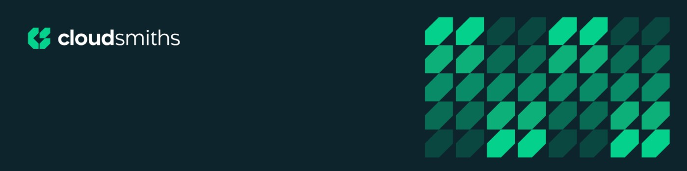

  
  <h1 style="margin-top: -130px; margin-bottom: 80px; padding-left:50px; color: white; text-shadow: 2px 2px 4px rgba(0,0,0,0.8); border-bottom: none; text-decoration: none;">
    Hey, I'm Q 👋
  </h1>

  
  
  

## What I Do

I build software and manage cloud platform 'stuff'. Primarily writing code, cloud infrastructure, orchestration & automation tools that get the job done.

## Tech Stack

### Cloud & Infrastructure

### Languages & Frameworks

### AI & Tools

---

  
  ### ...
  

