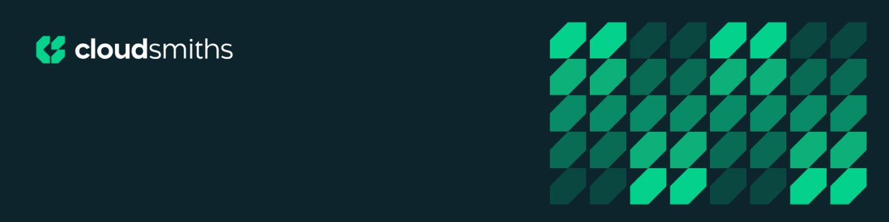

  
  <h3 style="margin-top: -130px; margin-bottom: 80px; padding-left: 50px; color: white; text-shadow: 2px 2px 4px rgba(0,0,0,0.8); border-bottom: none; text-decoration: none; font-size: 36px;">
    Hey, I'm Q 👋
  </h3>

  
  
  

## What I Do

I build software and the platforms that run it. Code, cloud infrastructure, automation, and whatever else gets the job done.

## Tech Stack

### Cloud & Infrastructure

### Languages & Frameworks

### AI & Tools

---

  
  ### ...
  

